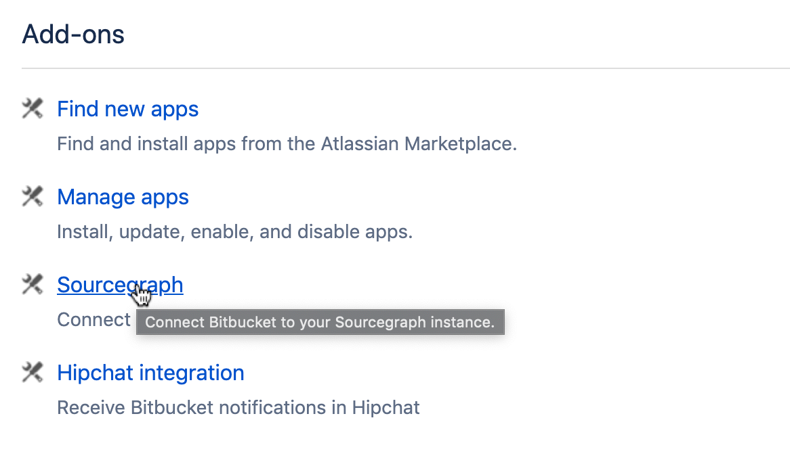
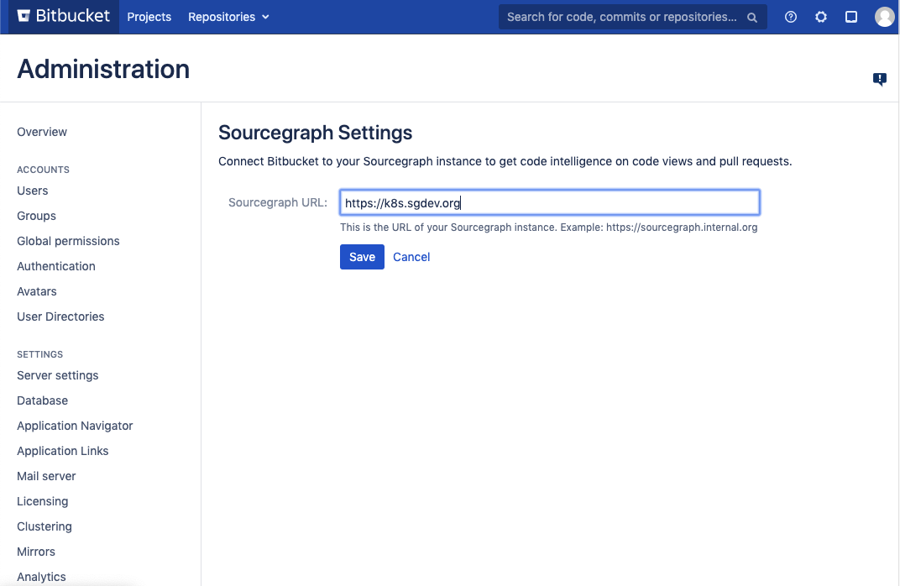
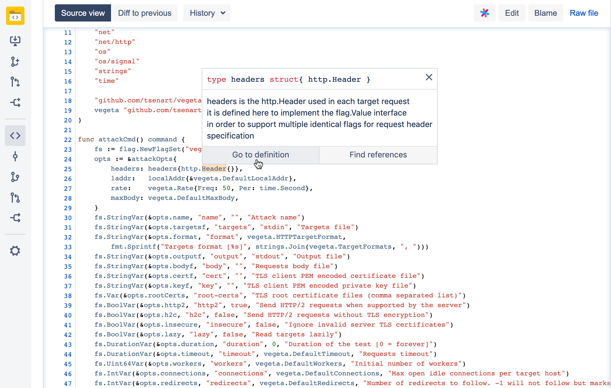

# Sourcegraph for Bitbucket Server

The Sourcegraph plugin for Bitbucket Server communicates with your Sourcegraph instance to add **code intelligence** to your Bitbucket Server code views and pull requests. The plugin also has the optional functionality to enable **faster ACL permission syncing between Sourcegraph and Bitbucket Server** and can add **webhooks with configurable scope to Bitbucket Server**.

## Installation and Usage

### Prerequisites

1. You must have a self-hosted Sourcegraph instance set up, v3.6 or higher.
2. Your Sourcegraph instance should have a Bitbucket Server [external service](https://docs.sourcegraph.com/admin/external_service/bitbucket_server) configured.
3. The `corsOrigin` property should be set in [site configuration](https://docs.sourcegraph.com/admin/config/site_config) to include the URL of your Bitbucket Server instance. Example value:

```json
    "corsOrigin": "https://bitbucket.internal.org"
```

### Installation

1. Log in to Bitbucket Server as an admin.
2. Navigate to the Bitbucket admin page.
3. Go to **Add-ons > Manage apps**.
4. Click **Upload app**
5. In the **From this URL** field, paste the following URL:

```
https://storage.googleapis.com/sourcegraph-for-bitbucket-server/latest.jar
```

### Updating

Follow the steps in [Installation](#installation).

### Configuration

After installing the Sourcegraph for Bitbucket Server, you should configure it to point to your Sourcegraph instance.

1. On Bitbucket, go to the **Administration** page
2. Find the **Sourcegraph** entry under **Add-ons**:



3. On the **Sourcegraph Settings** page, set the Sourcegraph URL to the URL of your self-hosted Sourcegraph instance:



### Usage

#### Native code intelligence

Once configured, Sourcegraph for Bitbucket Server will add code intelligence hovers to code views and pull requests for all users that are logged in to your self-hosted Sourcegraph instance. It will also add links to view repositories, files and diffs on Sourcegraph.



Additionally, activated [Sourcegraph extensions](https://docs.sourcegraph.com/extensions) will be able to add information to Bitbucket server code views and pull requests, such as test coverage data or trace/log information.

If a user is not logged in to Sourcegraph, they will still see the "View Repository on Sourcegraph" links, but code intelligence hovers as well as any data contributed by Sourcegraph extensions will not be displayed.

#### Webhooks

Go to **Administration > Add-ons > Sourcegraph** to see a list of all configured webhooks and to create a new one.

[See the `webhooks/README.md`](https://github.com/sourcegraph/bitbucket-server-plugin/tree/master/src/main/java/com/sourcegraph/webhook) for more details.

#### Faster permissions fetching

Sourcegraph for Bitbucket Server adds two REST endpoints to provide more efficient endpoints for fetching permissions data:

- `/permissions/repositories?user=<USERNAME>&permission=<PERMISSION_LEVEL>`<br /> Returns **a list of repository IDs** the given `user` has access to on the given `permission` level.
- `/permissions/users?repository=<REPO>&permission=<PERMISSION_LEVEL>`<br /> Returns **a list of user IDs** that have access to the given `repository` on the given `permission` level.

The lists returned by both endpoints are encoded as [Roaring Bitmaps](https://roaringbitmap.org/).

## Local Development

In order to develop locally you will need to install the [Atlassian Plugin SDK](https://developer.atlassian.com/server/framework/atlassian-sdk/downloads/), note that it supports installation via Homebrew on MacOS.

Due some older dependencies, you'll need develop using Java 8. To install on MacOS, do the following:

```
brew tap AdoptOpenJDK/openjdk
brew cask install adoptopenjdk8-openj9
```

Don't forget to set you `JAVA_HOME` environment variable for Java 8. On MacOS you can see your Java installations with the following command:

```aidl
/usr/libexec/java_home -V
```

-   `atlas-run` -- installs this plugin into the product and starts it on localhost
-   `atlas-debug` -- same as atlas-run, but allows a debugger to attach at port 5005
-   `atlas-help` -- prints description for all commands in the SDK

See also the Atlassian Plugin SDK [documentation](https://developer.atlassian.com/display/DOCS/Introduction+to+the+Atlassian+Plugin+SDK).

> The default credentials are `admin/admin` for the `atlas-run` environment.
